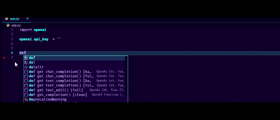

[](https://www.python.org/)
[](https://openai.com/)
[](https://github.com/Jesparzarom/OpenAIPy-Fragments/stargazers)
[](https://github.com/Jesparzarom/OpenAIPy-Fragments/network/members)
[](https://github.com/Jesparzarom/OpenAIPy-Fragments)
[](https://github.com/Jesparzarom/OpenAIPy-Fragments/issues)
[](https://github.com/Jesparzarom/OpenAIPy-Fragments/pulls)

[](https://marketplace.visualstudio.com/items?itemName=Jesparzarom.openaipy-fragments)
[](https://marketplace.visualstudio.com/items?itemName=Jesparzarom.openaipy-fragments)
[](https://marketplace.visualstudio.com/items?itemName=Jesparzarom.openaipy-fragments)
[](https://marketplace.visualstudio.com/items?itemName=Jesparzarom.openaipy-fragments)

# OpenAIPy Fragments


This is the README for the OpenAIPy Fragments extension, which provides helpful code snippets for developing with the OpenAI library in Python (openai-python).

# Usage 
## ✨ Features

OpenAIPy Fragments offers the following features:

- Code snippets to assist with OpenAI library development.
- Improved productivity and efficiency when working with the OpenAI library.
- Integration with Visual Studio Code for a seamless development experience.


## 📝 Shortcuts

### **◼ Setup import**
- `"setup basic"` - Imports the OpenAI library only.
- `"setup dotenv"` - Imports the OpenAI library, gets the API_KEY from the .env file.
- `"setup org"` - Imports the OpenAI library, gets the API_KEY from the .env file, and specifies the ORG ID.


### **◼ Helper functions**

#### chat_completion(...)
- `"defchat"` - Basic helper function for chat-based models.
- `"defchatfull"` - Full helper function for chat-based models, including all parameters.

#### text_completion(...)
- `"deftext"` - Basic helper function for text-based models.
- `"deftextfull"` - Full helper function for text-based models, including all parameters.

#### text_edit(...)
- `"defedit"` - Helper function for editing a completion, including all parameters (full option).


>
#### Empty helper function: 
> "get_completion()" is an empty helper function designed to set up completions from scratch.
> 

### **◼ Parameters**
> 
To fill in the parameters, follow these steps:

1. Write the parameter within the `.create(param...)` structure.
   - Example: If you want to set the temperature, use `"temperature="`.

2. Choose the desired value for the parameter by typing `=` followed by the desired value.
   - Example: To set the temperature value as 1, complete it as `temperature=1`.

Finding parameters:

- To search for a specific parameter, type `"param"` and review the available options.
- Select the desired parameter from the options to complete it in your code.

Additional notes:

- Parameters that come with a default value are written as `param=`.
- The `param` represents the name of the parameter and serves as a convenient shortcut.


### **◼ Models**
To specify the model, use the following keywords:
 
- For text model options, use `textmodel`.
- For chat model options, use `chatmodel`.
- For editing model options, use `editmodel`.

Example Usage:

- If you want to select from text model options, write `chatmodel` in your code.
- If you want to select from chat model options, also use `chatmodel`.
- If you're looking for editing model options, use `editmodel`.

By using these keywords, you will be presented with the relevant model options to choose from.

> Make sure to select the appropriate keyword based on your specific needs.
>
> Feel free to explore the available options and choose the model that best suits your requirements!
>
> If you have any further questions or need assistance, please let me know.


### SNIPPETS LIST: TRIGGERS AND DESCRIPTIONS
| TRIGGER| DESCRIPTION |
|-----------|-------------|
| | <h3>INITIAL SETUP</h3> |
| `setup basic` | Basic import |
| `setup dotenv` | Imports and load env key |
| `setup org` | Imports and load env key for ORG |
| | <h3>HELPER FUNCTIONS</h3> |
| `get text_completion() [base]` | Text completion (basic parameters) helper function |
| `get text_completion() [full]` | Text completion (full parameters) helper function |
| `get chat_completion() [base]` | Chat completion (basic parameters) helper function |
| `get chat_completion() [full]` | Chat completion (full parameters) helper function |
| `get text_edit() [full]` | Edit helper function |
| | <h3>PARAMETERS WHIT DEFAULT VALUE</h3> |
| `model= [parameter]` | Specifies the GPT model to be used. (Default value) |
| `prompt= [parameter]` | Specifies the text prompt. (Default value) |
| `messages= [parameter]` | A list of messages exchanged in a conversation. (Default value) |
| `suffix= [parameter]` | The suffix that comes after a completion of inserted text. (Default value) |
| `max_tokens= [parameter]` | Limits the maximum number of tokens in the generated response. (Default value) |
| `temperature= [parameter]` | Controls the randomness of the generated output. (Default value) |
| `top_p= [parameter]` | Controls the diversity of the generated output. (Default value) |
| `n= [parameter]` | Specifies the number of responses to generate. (Default value) |
| `stream= [parameter]` | Indicates whether to stream the output or retrieve the entire response at once. (Default value) |
| `logprobs= [parameter]` | Include the log probabilities on the logprobs most likely tokens. (Default value) |
| `echo= [parameter]` | Echo back the prompt in addition to the completion. (Default value) |
| `stop= [parameter]` | Specifies a stopping condition for the generated response. (Default value) |
| `presence_penalty= [parameter]` | Controls the model's tendency to talk about specific topics. (Default value) |
| `frequency_penalty= [parameter]` | Controls the model's preference for repeating similar responses. (Default value) |
| `best_of= [parameter]` | Generates best_of completions server-side and returns the "best". (Default value) |
| `logit_bias= [parameter]` | Allows biasing the model's output towards a certain behavior or style. (Default value) |
| `user [parameter]` | A unique identifier representing your end-user. (Default value) |
| `role` | Role in a conversation message. (Default value) |
| | <h3>PARAMETERS NAMES</h3> |
| `model` | OpenAI model - OpenAI model |
| `prompt` | OpenAI prompt - Text prompt |
| `messages` | OpenAI messages - Text message |
| `suffix` | OpenAI suffix - Text suffix |
| `max_tokens` | OpenAI max_tokens - Maximum tokens |
| `temperature` | OpenAI temperature - Temperature value |
| `top_p` | OpenAI top_p - Top-p value |
| `n` | OpenAI n - Number |
| `stream` | OpenAI stream - Stream value |
| `logprobs` | OpenAI logprobs - Log probabilities |
| `echo` | OpenAI echo - Echo value |
| `presence_penalty` | OpenAI presence_penalty - Presence penalty |
| `frequency_penalty` | OpenAI frequency_penalty - Frequency penalty |
| `best_of` | OpenAI best_of - Best of |
| `logit_bias` | OpenAI logit_bias - Logit bias |
| `user` | OpenAI user - User |
| `role` | OpenAI role - Role |
| `content` | OpenAI content - Content |
| `def get_completion() [clean]` | OpenAI Function clean - Get OpenAI model list |
| | <h3>OPENAI LIB ACTIONS</h3> |
| `openai.Model.list()` | OpenAI models - Get OpenAI model list |
| `openai.api_key =` | OpenAI API Key - Set OpenAI API key |
| `openai.Model.retrieve()` | OpenAI Model retrieve - Retrieve an OpenAI model |
| `openai.Completion.create()` | OpenAI Completion create - Create an OpenAI completion |
| `openai.ChatCompletion.create()` | OpenAI ChatCompletion create - Create an OpenAI chat completion |
| `openai.Edit.create()` | OpenAI Edit create - Create an OpenAI edit |
| `choices[0].message` | OpenAI Choices - First Choice Message - Access the message of the first choice in OpenAI choices |
| `choices[0].message['content']` | OpenAI Choices - First Choice Message Content - Access the content of the message in the first choice of OpenAI choices |
| `choices[0].text` | OpenAI Choices - First Choice Text - Access the text of the first choice in OpenAI choices |
| `choices[0].text.split()` | OpenAI Choices - First Choice Text Split - Split the text of the first choice in OpenAI choices |
| | <h3>CHAT MODELS</h3> |
| `gpt-4 [chat model]` | OpenAI GPT-4 - Chat completion model - GPT-4. Advanced language model for generating human-like text in chat-based scenarios. |
| `gpt-4-0314 [chat model]` | OpenAI GPT-4 (0314) - Chat completion model - GPT-4 (0314). Upgraded version of GPT-4 trained with data from March 2014. |
| `gpt-4-32k [chat model]` | OpenAI GPT-4 (32k) - Chat completion model - GPT-4 (32k). Variant of GPT-4 with a vocabulary size of 32,000 tokens. |
| `gpt-4-32k-0314 [chat model]` | OpenAI GPT-4 (32k, 0314) - Chat completion model - GPT-4 (32k, 0314). Variant of GPT-4 with a vocabulary size of 32,000 tokens, trained with data from March 2014. |
| `gpt-3.5-turbo [chat model]` | OpenAI GPT-3.5 Turbo - Chat completion model - GPT-3.5 Turbo. Highly capable language model for chat-based applications, offering improved performance over previous versions. |
| `gpt-3.5-turbo-0301 [chat model]` | OpenAI GPT-3.5 Turbo (0301) - Chat completion model - GPT-3.5 Turbo (0301). Variant of GPT-3.5 Turbo trained with data from March 2021. |
| | <h3>TEXT MODELS</h3> |
| `text-davinci-003 [text model]` | OpenAI Text Davinci (003) - Completion model - Text Davinci (003). General-purpose language model for generating high-quality text in a wide range of contexts. |
| `text-davinci-002 [text model]` | OpenAI Text Davinci (002) - Completion model - Text Davinci (002). Variant of Text Davinci offering similar capabilities with minor differences. |
| `text-curie-001 [text model]` | OpenAI Text Curie (001) - Completion model - Text Curie (001). Powerful language model for generating text, designed for various creative and informative tasks. |
| `text-babbage-001 [text model]` | OpenAI Text Babbage (001) - Completion model - Text Babbage (001). Language model focused on generating text with specific prompts and instructions. |
| `text-ada-001 [text model]` | OpenAI Text Ada (001) - Completion model - Text Ada (001). Language model designed for specific use cases and industries, offering specialized text generation capabilities. |
| | <h3>TEXT EDIT MODELS</h3> |
| `text-davinci-edit-001 [edit model]` | OpenAI Text Davinci Edit (001) - Edit model - Text Davinci Edit (001). Language model optimized for assisting in editing and improving text, providing helpful suggestions and corrections. |
| `code-davinci-edit-001 [edit model]` | OpenAI Code Davinci Edit (001) - Edit model - Code Davinci Edit (001). Language model specialized in assisting with code editing tasks, offering suggestions and enhancements for programming languages. |


---


## 📢 Requirements

- `openai-python` library (Required)
```bash
pip install openai-python
```
- `python-dotenv` module (Recommended)
```bash
pip install python-dotenv
```

---

## Known Issues

Please report any issues you encounter by creating a new [issue](https://github.com/Jesparzarom/OpenAIPy-fragments/issues) in this repository. We appreciate your feedback and contributions to help improve this project.

If you have any questions or need assistance, feel free to reach out by opening an issue. Thank you for your support!


## ⏫ Release Notes

Initial release
### Version 1.0.0 (2023-05-26)
- Initial release of OpenAIPy Fragments

---

### Thanks for installing this extension. I hope it proves to be highly useful for you.
